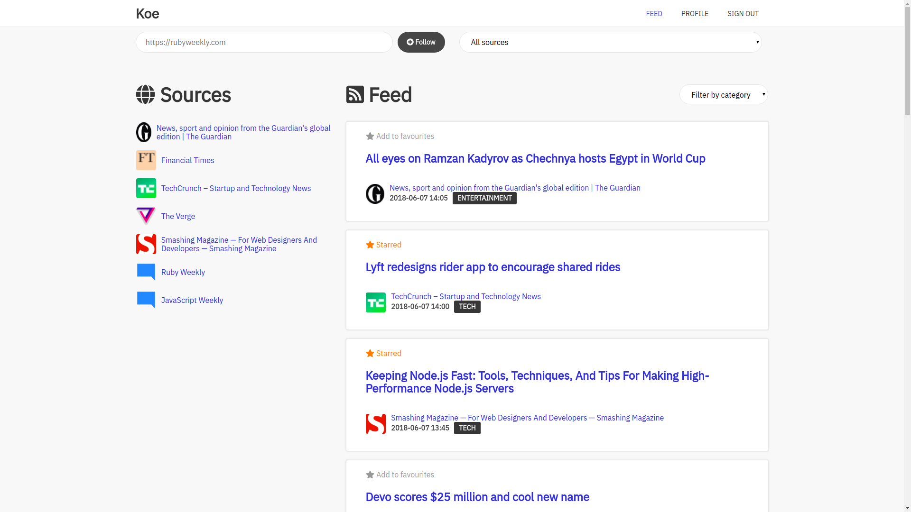

# Koe

A **news reader** wrote in Flask which use _machine learning_ to classify articles.



## What is it

This is my final exams' project which demonstrates how machine learning could be used
in real-life applications and how developers can embrace it to simplify complex tasks.

My goal is to create a simple application which combine the versatility of the Web with
the interesting and exciting possibilities offered by machine learning.

Since this project is meant to show what I've learnt at school, I chose to reinvent the wheel
a couple of times:

  - Raw SQL queries instead of SQLAlchemy
  - No JS frameworks
  - No CSS frameworks (except Normalize.css)
  - Custom controllers instead of Flask-RESTful

## Requirements

- **Python >= 3.x** + _pip_ package manager
- **Node >= 6.x** + _npm_ package manager
- **cron** or one of its forks

## Installation

Clone this repository:

```shell
git clone https://github.com/domcorvasce/koe
```

Then install the necessary Python modules and Node packages:

```shell
pip install -r requirements.txt
npm i
```

## Getting Started

### Train the prediction model

Koe uses machine learning to classify news so you need a prediction model which takes
the article you just fetched and let it put the article in one of these categories:

  - Business
  - Politics
  - Entertainment
  - World
  - Tech
  - Sport
  - Health
  - US

You need to train the prediction model only one time then a `model.pkl` file will be generated and
you'll use it to predict the articles' categories.

Clone the dataset:

```shell
git clone https://github.com/domcorvasce/news-dataset
```

Then execute the training script included in Koe:

```shell
python jobs/classifier/model.py YOUR_PATH/news-dataset/dataset.csv
```

The whole process will require a couple of minutes or hours depending on the computer you use: the script is setup
to use all the available CPU cores to be faster.

After the script has finished, a `model.pkl` file will appear.

### Setup the news fetcher

Koe works by running, through _cron_, a script which every N minutes fetches news
by the various sources the users are subscribed to.

The script you need to run is at `jobs/fetch_news.py`: take a look to the cron documentation
to know about how setup a cronjob for it.

### The easy part

Rename `.env.example` to `.env` and edit based on your preferences.

After you're done, generate static assets:

```shell
npm run build
```

Finally, run the application:

```shell
./start.sh
```

## License

The code in this repository is licensed under [GNU/GPL v3](LICENSE).